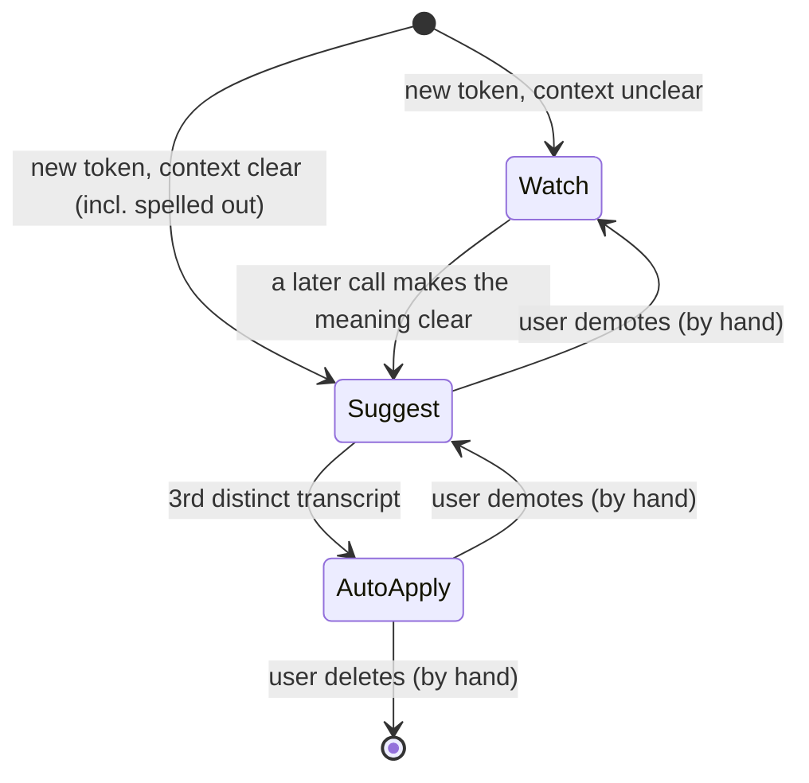

# How the ladder works

Every row in the glossary sits on one of three rungs. A row climbs only on evidence, and evidence means **distinct transcripts**.

## The state machine

```
         a new token is resolved (or half-resolved) from context
                               │
          context unclear      │      context clear
         ┌─────────────────────┴─────────────────────┐
         ▼                                           ▼
   ┌────────────┐   a later call makes        ┌────────────┐
   │   WATCH    │   the meaning clear  ─────▶ │  SUGGEST   │
   │            │                             │            │
   │ record     │                             │ apply AND  │
   │ only,      │                             │ flag in the│
   │ never apply│                             │ note       │
   └────────────┘                             └─────┬──────┘
                                                    │ sighting count reaches 3
                                                    │ (3rd DISTINCT transcript)
                                                    ▼
                                              ┌────────────┐
                                              │ AUTO-APPLY │
                                              │            │
                                              │ replace on │
                                              │ sight, but │
                                              │ still check│
                                              │ the context│
                                              └────────────┘

   Only you move a row DOWN, or delete it (guard 4). The skill never demotes.
```

The same diagram in mermaid, for renderers that support it:



## What each rung does to the note

| Rung | In the cleaned transcript | In the "Contradictions & things to verify" table |
|---|---|---|
| Watch | Raw text left exactly as heard. Never applied, no exceptions. | Nothing (the sighting is only counted in the glossary) |
| Suggest | Replaced | One row: raw heard, what was applied, why it is flagged |
| Auto-apply | Replaced | Nothing, unless the context check failed. Then the raw text stays and a row says so. |

Only Category A has a Sightings column. Categories B to E keep the count at the start of the Notes cell: `seen 2 (last 2026-09-15)`.

## Counting sightings

A sighting is one transcript in which the token appeared. Not one occurrence.

- A speaker says "you no track" eleven times in one call: **+1**.
- The same speaker says it once in each of three calls: **+3**.

Why: one person's habit inside one meeting proves very little. Three separate meetings, often with different people and different microphones, prove the pattern is real. Counting occurrences would let one long call promote a mistake to Auto-apply on its own.

## Why three

Three is the smallest number that rules out "one bad recording" and "one person's accent on one day". It is also small enough that a real pattern gets promoted inside a couple of weeks of normal calls. Change `promote_at` in `config/clean-transcript.json` if your volume is very different, but keep it above one.

## What does not move a row

- Being in a pack. Pack rows arrive at whatever tier you merge them at. Your own sightings start at zero.
- Being confident. The agent's confidence about a token is not evidence. Only a new transcript is.
- Being repeated in a summary. The capture tool's AI summary is derived from the transcript. It is not a second sighting.

## Walk it once

`examples/walkthrough.md` follows one entry, "you no track" → JunoTrack, up all three rungs across three synthetic calls.
